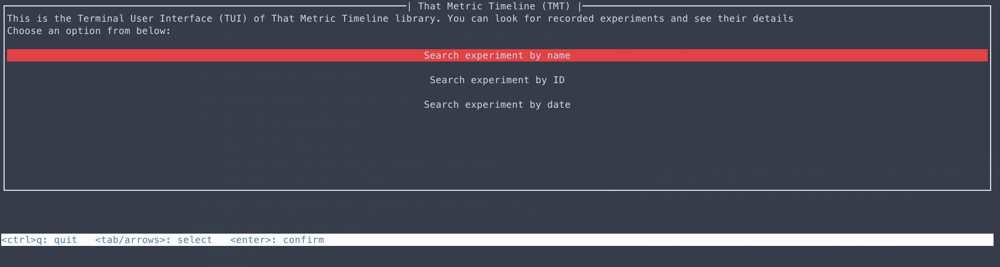
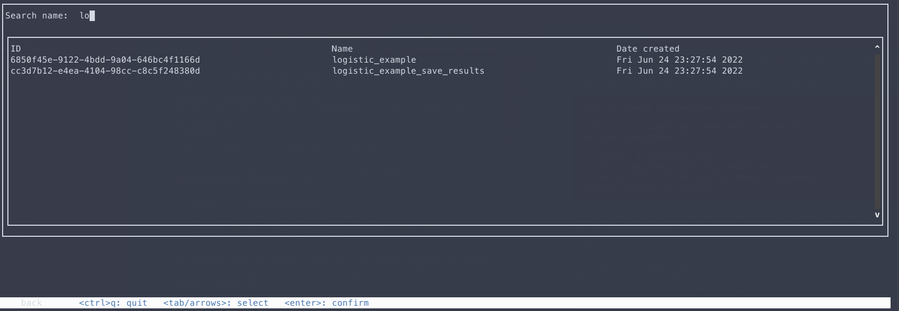
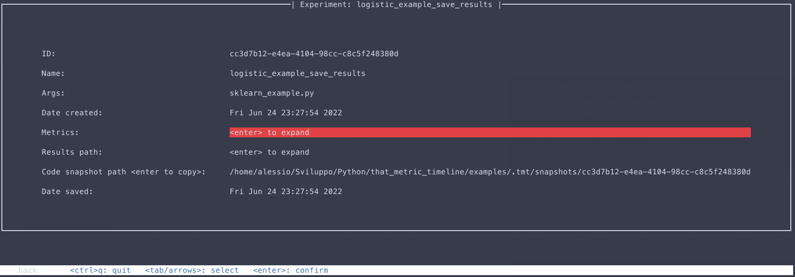

# That Metric Timeline (TMT) ⌚
[](https://thatmetrictimeline.readthedocs.io/en/latest/?badge=latest) [](https://www.gnu.org/licenses/gpl-3.0)  [](https://zenodo.org/badge/latestdoi/507277225)

That Metric Timeline (TMT) is a Python library aimed at the machine/deep learning practitioner/researcher. This library aims to:  
  * Help the user to keep track of experiments, their metrics, their results and the code used to produce them;  
  * Provide an easy-to-use and [KISS](https://en.wikipedia.org/wiki/KISS_principle) based library to the user;  
  * Do the bare-minimum (i.e., no fancy web interfaces, plotting and so on), but do it (hopefully) right;  
  * Give an open-source experiment tracking library to the community which is free both as in "free beer" and "free speech".  
  
So many times when working on a research project I've seen the number of experiments skyrocketing in the blink of an eye...and then when we come back to our project after "some time off", we may have lost track of where the results are, what was the code that produced them and so on.  
This library can hopefully be a solution to all of this :)

Read the full documentation on [ReadTheDocs](https://thatmetrictimeline.readthedocs.io/en/latest/).

## Installation
The library is available on PyPI, and can be installed with
```
pip install ThatMetricTimeline
```
After a successful installation, a binary `tmt_tui` will be available in your path. This is the library terminal user interface (TUI). More on this [later](#tui).

## Usage
`tmt` can keep track of your experiments. Every experiment will be saved as an entry in a json database, with results and code snapshot backups[^1] saved in different folders. By default, `tmt` will:  
 * Create a `.tmt` directory in your current working directory;  
 * Create a `.tmt/tmt_db.json` file which will be used as a database;  
 * Create a `.tmt/snapshots` directory, where code snapshot backups will be saved. A symlink `.tmt/snapshots/last` will also be created and will always point to the last snapshot taken. See the [Snapshots](#snapshots) section for more details.

Should you want to change where all of this is saved, check the [Custom configuration](#custom-configuration) section.  
Code examples are provided in the `examples` folder in this repository. More examples will be added in the future.

[^1]: Code backup is taken as a "snapshot". It means that the first time it will be a standard copy of all your files (you can provide a `.gitignore` file to ignore files). The following backups will only copy new and changed files, while everything else is copied as a hard-link (therefore not occupying space on your disk).

### Tracking experiments
While more optional features will probably come in the future, the library goal is to be simple, both for the user and for the library developer.  
The main function exposed by `tmt` is actually the `tmt_recorder` decorator. This is what we use to actually store and keep track of experiments.  

The decorator takes a `name` parameter (and a few optional more). The experiment will be saved and later searched with this name.  
The decorated function might return a dictionary with the metrics the user wishes to save for later retrieval. If you don't want to save any metric, the function must return `None` or an empty object (e.g. `{}`).
```python
from tmt import tmt_recorder

@tmt_recorder(name="some_experiment")
def train_and_predict(x_tr, y_tr, x_te, y_te):
    lr = LogisticRegression()
    lr.fit(x_tr, y_tr)
    preds = lr.predict(x_te)
    return {'f1': f1_score(y_te, preds), 'accuracy': accuracy_score(y_te, preds)}
```
The other key function `tmt` exposes is `tmt_save`. This function should be called by the user to save any kind of pickable object, at any time.  
If we wanted to save the predictions in the example above, we would do:
```python
from tmt import tmt_recorder, tmt_save

@tmt_recorder(name="some_experiment_with_data")
def train_and_predict(...):
    ...
    preds = lr.predict(x_te)
    tmt_save(preds, name='lr_predictions')
    return {'f1': f1_score(y_te, preds), 'accuracy': accuracy_score(y_te, preds)}
```
As you can see, we give a name to the saved object as well. This should make it easier to recognize what this pickled object refers to.

## TUI

### Searching and looking at experiments
`tmt` offers a terminal user interface (TUI) which should be installed in your path when you `pip install` the library.
You can access the TUI by typing:

```
tmt_tui
```

If you're using a custom configuration (see [Custom configuration](#custom-configuration)), specify it like this:

```
tmt_tui -c /path/to/your/config.json
```

You will be presented with the following old-fashioned interface (who doesn't love the 90s?):


You can move around with the arrow (or the tab and shift+tab) keys. You can then search by name (supports regex!) in this interface:


Once you select an experiment you can see some details about it:


The __Search experiment by date__ functionality is not implemented yet and will come in a future release. You can however use the `TmtManager` (see the next section).

## Loading and using tracked experiments in your code
`tmt` offers a minimalistic `TmtManager` helper class, which can help you load an experiment in your code, load pickled results, see metrics etc.  
Once you have the ID (or a unique name for your experiment) you can:
```python
from tmt import TmtManager

# Let's say we know there is an experiment with id "example"


# An Entry is a row in the database, i.e. an experiment that was tracked.
manager = TmtManager()
manager.set_entry_by_id('example') 

# load the results and unpickle them
for name, path in manager.results_paths():
    with open(path, 'rb') as f:
        # do stuff with your results. If it's a pickle it's 
        # more convenient to use the code block below this one
        res = pickle.load(f)

# load the unpickled results
for name, res in manager.load_results():
    # do something with your results.
    # if res is a numpy array...
    print(res.mean())


for name, val in manager.get_metrics():
    print(f"{name}: {val}")
```

Should you need it, you can access the "low level" database manager from the `manager.db` member.
```python
# If you need to do other stuff, like searching for 
# experiments between two datetimes and so on
# you can access the `db` member like
manager.db.get_entries_greater_than_date(date_or_timestamp)

# You can also search names with a regex
manager.db.get_entries_by_name_regex(r'experiment\d+')
```

## Snapshots
Every time you track an experiment with `tmt_recorder`, a code snapshot backup will be saved (by default in `.tmt/snapshots`). This means that:  
 * the first time you use the library in your project, a simple copy of your project is made (by default, this is the current working directory (_cwd_) from which you launch the experiment);  
 * subsequent backups will only copy new and different files, while hard-linking all other files. This limits the space taken on your disk;  
 * by default, the library will look for a `.gitignore` file in your _cwd_ and ignore (i.e., not copy) all files listed in there (the [PathSpec](https://python-path-specification.readthedocs.io/en/latest/readme.html) library is used for gitignore parsing;
 * a symlink pointing to the last snapshot taken is created (and updated everytime) in `.tmt/snapshots/last`.  

You can change the default paths by using a [Custom configuration](#custom-configuration) file.

## Custom configuration
`tmt` can be used as-is and does not require any configuration file. By default, everything the library needs or save is stored in a `.tmt` hidden directory, in the current working directory(_cwd_). If your _cwd_ changes often for different experiments, or if you want to specify which folder is backed up and more, you may want to create and specify a custom configuration file.  
  
To do so, create a `config.json` file: if you're fine with using the `cwd/.tmt` directory, place this file in `cwd/.tmt/config.json`. This way, you won't have to specify the path to this configuration file to library related functions.  
The configuration file has the following structure
```json
{
    // tmt_dir specifies the path where code snapshots and 
    // results will be saved. You may use an absolute 
    // path as well
    "tmt_dir": ".example",

    // this is the folder we will take a snapshot of 
    // for every experiment  
    "snapshot_source": ".", 

    // snapshot_target is where code snapshots will be 
    // saved. It will be joined with tmt_dir. So in this 
    // case the target will be .examples/snapshot_example
    "snapshot_target": "snapshot_example",

    // this path will be a symlink to the last snapshot
    // taken. Same rules as for snapshot_target apply
    "last_snapshot_link": "snapshot_example/last",

    // this might actually be any file with a .gitignore 
    // syntax. These files will be ignored and not backupped
    "gitignore_path": "path/to/.gitignore",

    // the two paths below are for the db and the results
    // directory, respectively. Same rules apply as for 
    // snapshot_target, so path will be .example/tmt_db.json
    "json_db_path": "tmt_db.json",
    "results_path": "results"
}
```
As mentioned, if you save this file in `.tmt/config.json`, no other action is necessary and `tmt` will pick it up and use it for its configuration.  
If instead you save it somewhere else, say `/config/path/config.json`, you will have to specify this path in the code. When recording experiments:
```python
@tmt_recorder('custom_config', config_path='/config/path/config.json')
def with_custom_config():
    x, y = make_classification()
    lr = LogisticRegression()
    lr.fit(x, y)
    preds = lr.predict(x)
    return {'f1': f1_score(y, preds), 'accuracy': accuracy_score(y, preds)}
```
And when managing experiments:
```python
manager = TmtManager(config='/config/path/config.json')
# do your stuff
```

## Final remarks
This project was mainly developed because I wanted to have a simple library to keep track of the machine learning experiments I run for my papers in my PhD (and also, because I had fun :D).  
I'm well aware that there are other options at the moment such as [Weights&Biases](https://wandb.ai/site) and [ModelChimp](https://github.com/ModelChimp/modelchimp), but I wanted something that was as straightforward and as simple as possible.   
The aim of this project should be to keep a [KISS](https://en.wikipedia.org/wiki/KISS_principle) approach, making it 
easier for other researchers to tinker with the library code or to make adjustments.  
For this reason, there is not much automation provided, and, for instance, navigating snapshots is left to the user: when you want to quickly check the code for many experiments this 
might be a pain and I indeed plan to add a better and more automated way to do that.  
That said, most of the other library functionalities will remain as they are now.

If you have any suggestions, feedbacks or problems, feel free to open an issue or a pull request here on Github.  
Cheers!