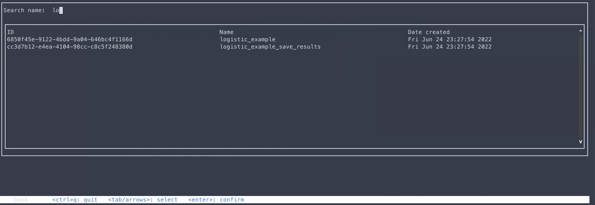
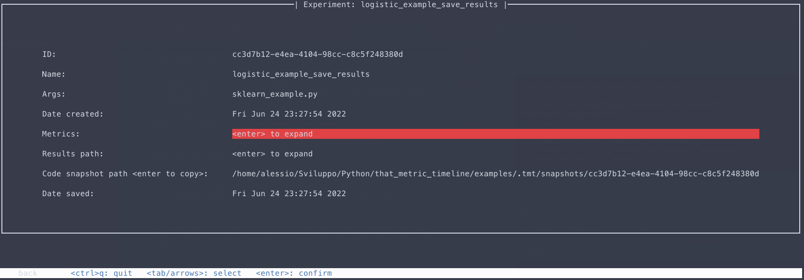

Quickstart
**********

.. _installation:

Installation
============

``tmt`` is available on `PyPI <https://pypi.org/project/ThatMetricTimeline/>`_ and can be installed with:

.. code-block::

    pip install ThatMetricTimeline

.. _usage:

Usage
=====

``tmt`` can keep track of your experiments. Every experiment will be saved as an entry in a ``json`` database, with results and code snapshot backups saved in different folders. By default, ``tmt`` will:

 - Create a ``.tmt`` directory in your current working directory;
 - Create a ``.tmt/tmt_db.json`` file which will be used as a database;
 - Create a ``.tmt/snapshots`` directory, where code snapshot backups will be saved. A symlink ``.tmt/snapshots/last`` will also be created and will always point to the last snapshot taken. See the :doc:`snapshots` section for more details.

Should you want to change where all of this is saved, check the :doc:`configuration` section.
Code examples are provided in the examples folder on `Github <https://github.com/levnikmyskin/that_metric_timeline/tree/main/examples>`_.

Tracking experiments
--------------------

While more optional features will probably come in the future, the library goal is to be simple, both for the user and for the library developer.  
The main function exposed by ``tmt`` is actually the ``tmt_recorder`` decorator (see :py:func:`tmt.decorators.recorder.recorder`). This is what we use to actually store and keep track of experiments.  

The decorator takes a ``name`` parameter (and a few optional more). The experiment will be saved and later searched with this name.  
The decorated function might return a dictionary with the metrics the user wishes to save for later retrieval. If you don't want to save any metric, the function must return ``None`` or an empty object (e.g. ``{}``).

.. code-block:: python

    from tmt import tmt_recorder

    @tmt_recorder(name="some_experiment")
    def train_and_predict(x_tr, y_tr, x_te, y_te):
        lr = LogisticRegression()
        lr.fit(x_tr, y_tr)
        preds = lr.predict(x_te)
        return {'f1': f1_score(y_te, preds), 'accuracy': accuracy_score(y_te, preds)}

The other key function ``tmt`` exposes is ``tmt_save`` (see :py:func:`tmt.history.utils.save`). This function should be called by the user to save any kind of pickable object, at any time.  
If we wanted to save the predictions in the example above, we would do:

.. code-block:: python
    :emphasize-lines: 7

    from tmt import tmt_recorder, tmt_save

    @tmt_recorder(name="some_experiment_with_data")
    def train_and_predict(...):
        ...
        preds = lr.predict(x_te)
        tmt_save(preds, name='lr_predictions')
        return {'f1': f1_score(y_te, preds), 'accuracy': accuracy_score(y_te, preds)}

As you can see, we give a name to the saved object as well. This should make it easier to recognize what this pickled object refers to.

.. _tmttui:

TMT Terminal User Interface 
-------------------------------------

``tmt`` offers a terminal user interface (TUI) which should be installed in your path when you ``pip install`` the library.
You can access the TUI by typing:

.. code-block::

    tmt_tui

This should be launched from the root of your project. If you're using a custom configuration (see :doc:`configuration`), you can specify it like this:

.. code-block::

    tmt_tui -c /path/to/your/config.json

You will be presented with the following old-fashioned interface (who doesn't love the 90s?):

.. image:: ../../.github/assets/main_tui.png

You can move around with the arrow (or the tab and shift+tab) keys. You can then search by name in this interface:

Once you select an experiment you can see some details about it:

The ``Search experiment by date`` functionality is not implemented yet and will come in a future release. You can however use the ``TmtManager`` (see the next section, and :py:func:`tmt.utils.manager.TmtManager`).

.. _loadingexperiments:

Loading and using tracked experiments in your code
--------------------------------------------------

``tmt`` offers a minimalistic ``TmtManager`` helper class, which can help you load an experiment in your code, load pickled results, see metrics etc.  
Once you have the ID (or a unique name for your experiment) you can:

.. code-block:: python

    from tmt import TmtManager

    # Let's say we know there is an experiment with id "example"

    # An Entry is a row in the database, i.e. an experiment that was tracked.
    manager = TmtManager()
    manager.set_entry_by_id('example') 

    # load the results and unpickle them
    for name, path in manager.results_paths():
        with open(path, 'rb') as f:
            # do stuff with your results. If it's a pickle it's 
            # more convenient to use the code block below this one
            res = pickle.load(f)

    # load the unpickled results
    for name, res in manager.load_results():
        # do something with your results.
        # if res is a numpy array...
        print(res.mean())

    for name, val in manager.get_metrics():
        print(f"{name}: {val}")

Should you need it, you can access the "low level" database manager from the ``manager.db`` member.

.. code-block:: python

    # If you need to do other stuff, like searching for 
    # experiments between two datetimes and so on
    # you can access the `db` member like
    manager.db.get_entries_greater_than_date(date_or_timestamp)
